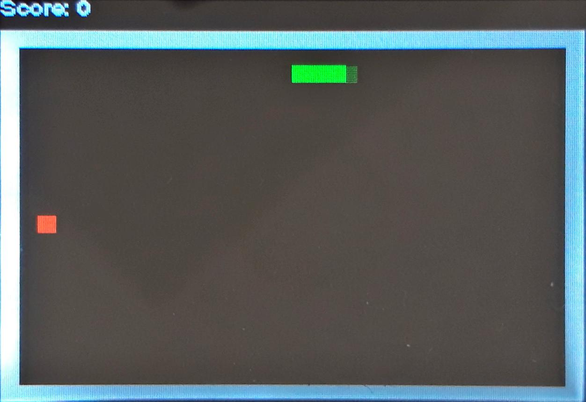

# Readme

Welcome to my version of Snake, written specifically for the ODROID GO gameboy!



## How to play

### Install MicroPython on your ODROID GO

You can view this [micropython setup tutorial](https://wiki.odroid.com/odroid_go/micropython/01_micropython_setup) on their site. When it comes to choosing your ESP 32 firmware, I ran this Snake project on the esp32-idf3-20191220-v1.12.bin version.

After installing the firmware, sync the folder of this repository to your ODROID GO.

1. open rshell

```bash
rshell --buffer-size 32 -a -p /dev/ttyUSB0
```

2. Navigate to the folder containing the `boot.py` file. In this case, this is the `src` folder.
3. Sync this folder to the ODROID GO

```bash
rsync -m . /pyboard
```

## Playing the game

You can play the game by pressing the `menu` button while turning the odroid on.


## Issues & feature requests

If you have issues running the game, or you have suggestions on how to improve this project, feel free to [submit an issue](https://github.com/wserr/Snake/issues)!